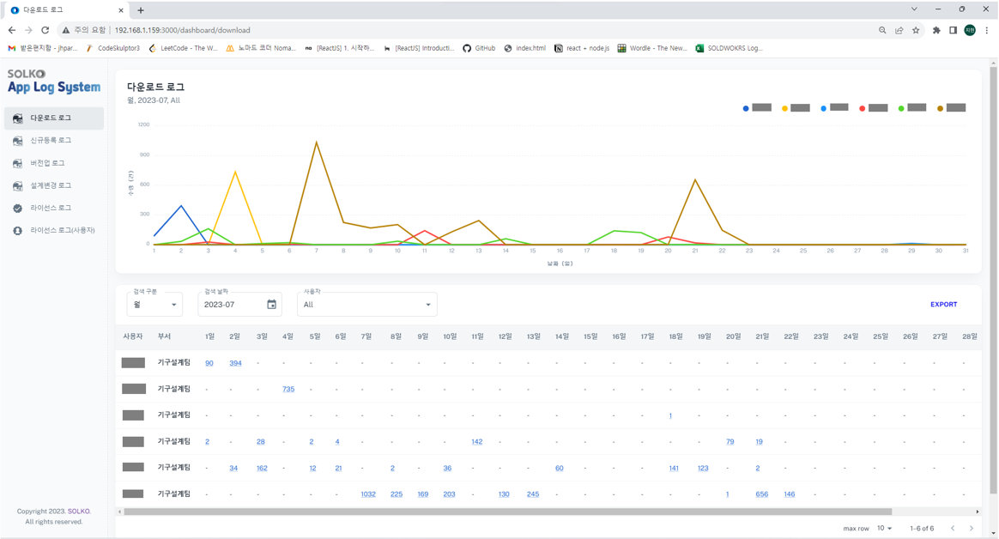
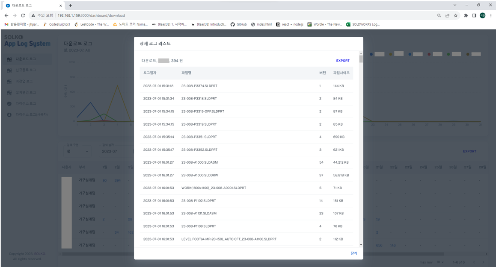
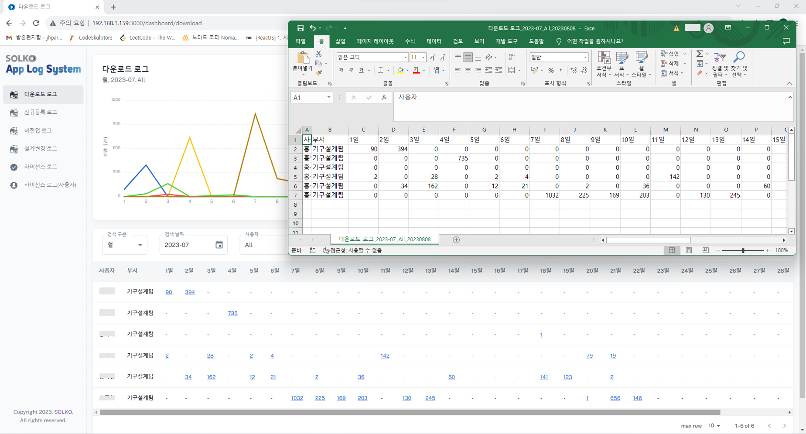
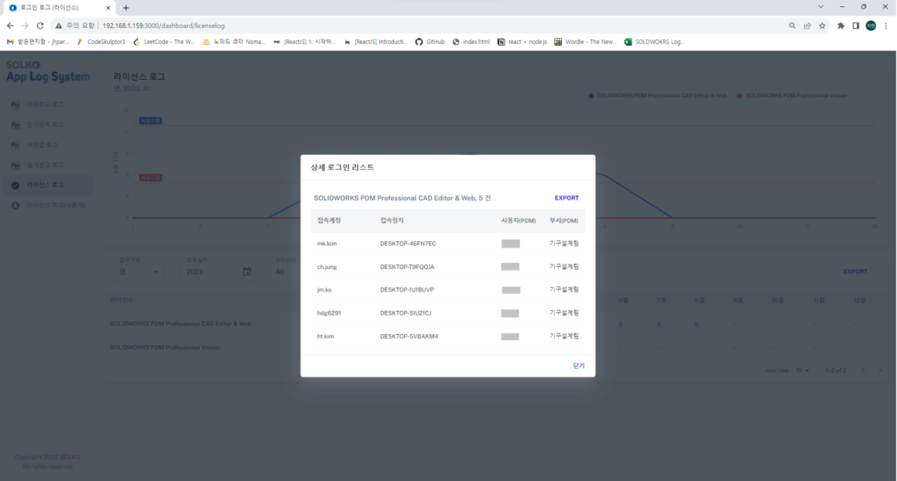
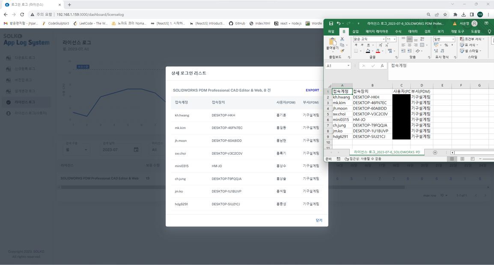
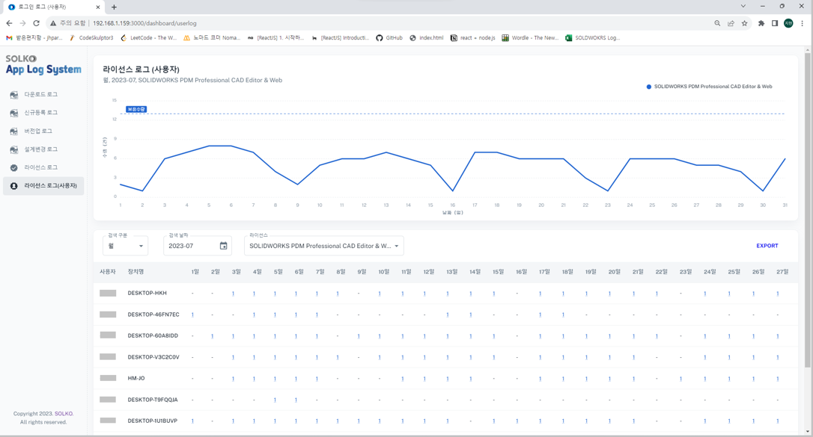
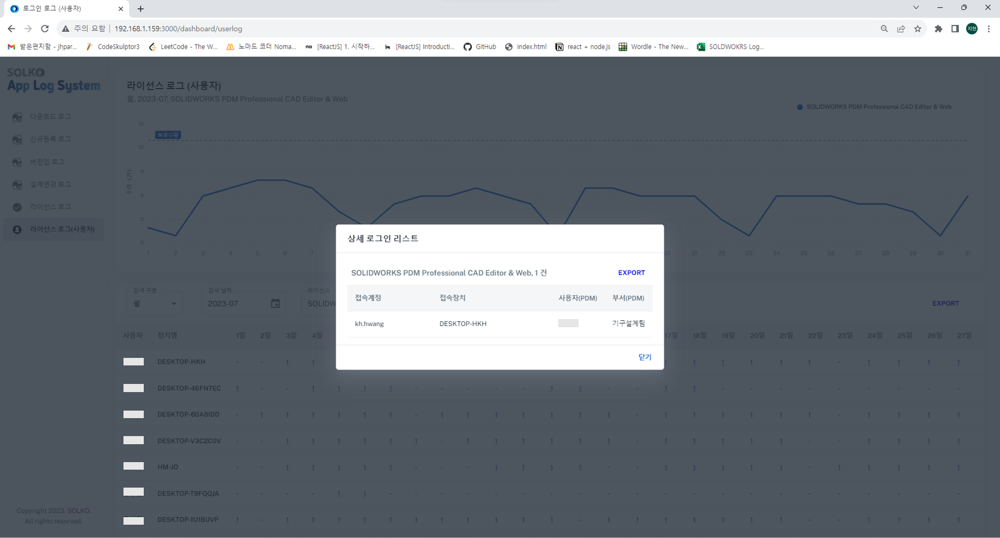

## Solko App Log System (Made from [Minimal Free version](https://minimal-kit-react.vercel.app/))

__Solko에서 개발한 Solidworks/PDM 로그 시스템__
1. 직원들의 파일 접속/관리 기록 조회 가능
2. 직원들의 솔리드웍스 접속 기록 조회 가능

## Page demo

- 다운로드, 신규등록, 버전업, 설계변경 로그 
  - 월/년 단위로 검색 가능
  - 사용자 별 검색 가능
  - csv 파일로 내보내기 기능
- 다운로드, 신규등록, 버전업, 설계변경 로그 상세 
  - 상세 날짜/시간, 파일 명/사이즈 조회 가능
  - csv 파일로 내보내기 기능 
- 라이선스 로그 
  - 일/월/년 단위로 검색 가능
  - 라이선스 별 검색 가능
  - csv 파일로 내보내기 기능
- 라이선스 로그 상세 
  - 접속계정/장치/사용자 명 조회 가능
  - csv 파일로 내보내기 기능 
- 라이선스 사용자 로그 
  - 일/월/년 단위로 검색 가능
  - 라이선스 별 검색 가능
  - csv 파일로 내보내기 기능
- 라이선스 사용자 로그 상세 
  - 접속계정/장치/사용자 명 조회 가능
  - csv 파일로 내보내기 기능

## Getting started

- Recommended `node js 16.x` and `npm 6+`. (suggestion v16.15.0)
- Install dependencies: `npm install` / `yarn install`
- Start the project: `npm run start` / `yarn start`
