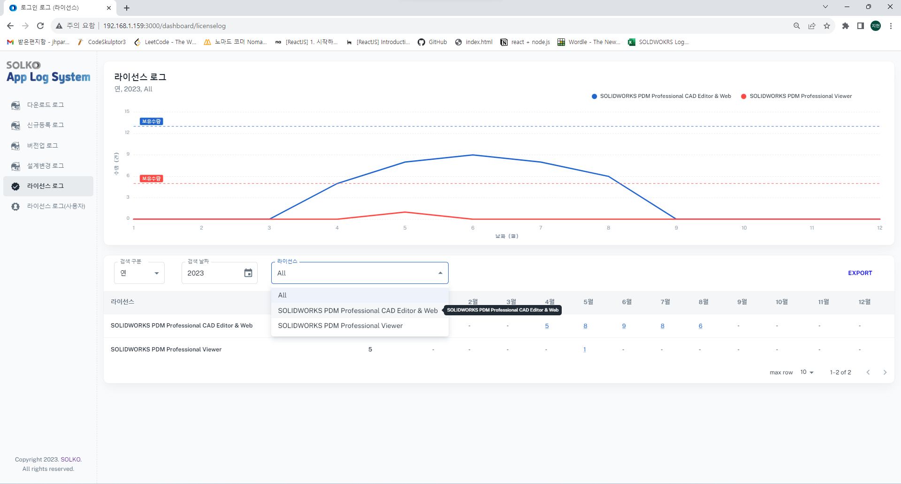

## Solko App Log System (Made from [Minimal Free version](https://minimal-kit-react.vercel.app/))

__Solko에서 개발한 Solidworks/PDM 로그 시스템__
1. 직원들의 파일 접속/관리 기록 조회 가능
2. 직원들의 솔리드웍스 접속 기록 조회 가능

## 페이지 설명

- 다운로드, 신규등록, 버전업, 설계변경 로그 
  - 월/년/기간 단위로 검색 가능
  - 사용자 별 검색 가능
  - csv 파일로 내보내기 기능
  - 데이터 클릭 시 상세 페이지 열람

- 다운로드, 신규등록, 버전업, 설계변경 로그 상세 
  - 상세 날짜/시간, 파일 명/사이즈 조회 가능
  - csv 파일로 내보내기 기능 

- 라이선스 로그  
  - 일/월/년/기간 단위로 검색 가능
  - 라이선스 별 검색 가능
  - csv 파일로 내보내기 기능
  - 데이터 클릭 시 상세 페이지 열람

- 라이선스 로그 상세 
  - 접속계정/장치/사용자 명 조회 가능
  - csv 파일로 내보내기 기능 

- 라이선스 사용자 로그 
  - 일/월/년/기간 단위로 검색 가능
  - 라이선스 별 검색 가능
  - csv 파일로 내보내기 기능
  - 데이터 클릭 시 상세 페이지 열람

- 라이선스 사용자 로그 상세 
  - 접속계정/장치/사용자 명 조회 가능
  - csv 파일로 내보내기 기능
